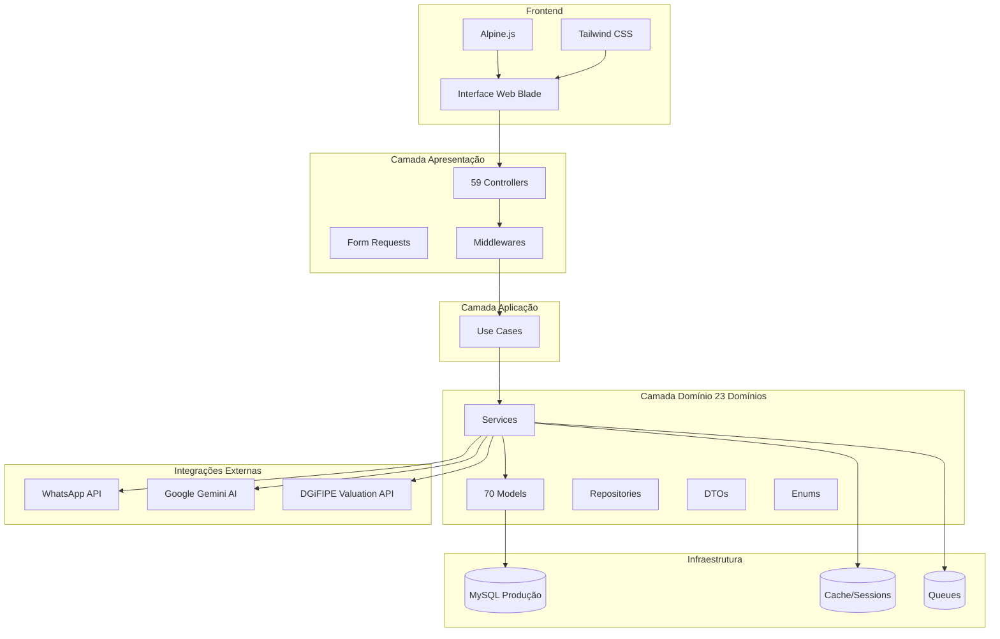
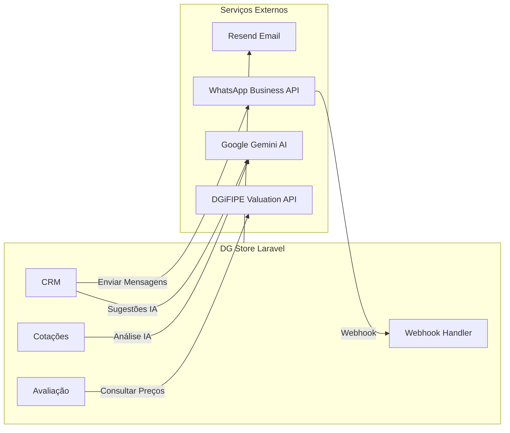

# Análise Completa do Sistema DG Store

**Data da Análise:** 07 de Junho de 2026  
**Versão do Sistema:** 1.0.0  
**Analista:** Cursor AI Agent

---

## 📋 Sumário Executivo

O **DG Store** é um sistema completo de gestão empresarial (ERP) desenvolvido em Laravel 11, especializado em loja de iPhones e produtos Apple, com expansões para B2B, perfumes, e gestão de fornecedores. O sistema utiliza arquitetura DDD (Domain-Driven Design) Lite e possui interface moderna baseada em Tailwind CSS e Alpine.js.

### Características Principais

- **Plataforma:** Laravel 11.31 (PHP 8.2+)
- **Frontend:** Blade + Alpine.js + Tailwind CSS
- **Banco de Dados:** MySQL 8.0+ (Produção em 187.77.37.51)
- **Arquitetura:** DDD Lite com separação clara de domínios
- **Deployment:** VPS Hostinger (srv1360734.hstgr.cloud)
- **Backup:** Automatizado diariamente às 03:00

---

## 🏗️ Arquitetura do Sistema

### Estrutura de Código (DDD Lite)

O sistema segue uma arquitetura em camadas com 23 domínios distintos:

```
app/
├── Domain/                      # 23 domínios de negócio (159 arquivos PHP)
│   ├── Product/                 # Gestão de produtos
│   ├── Sale/                    # Vendas e PDV
│   ├── Customer/                # Clientes
│   ├── Stock/                   # Estoque
│   ├── Finance/                 # Financeiro
│   ├── CRM/                     # Pipeline de vendas
│   ├── Supplier/                # Fornecedores
│   ├── ConsignmentStock/        # Estoque consignado
│   ├── B2B/                     # Vendas atacado
│   ├── Perfumes/                # Linha de perfumes
│   ├── Valuation/               # Avaliação de preços
│   ├── Warranty/                # Garantias
│   ├── Reservation/             # Reservas
│   ├── Import/                  # Importações
│   ├── Payment/                 # Pagamentos
│   ├── Marketing/               # Marketing digital
│   ├── Commission/              # Comissões
│   ├── Schedule/                # Agendamentos
│   ├── Checklist/               # Checklists de dispositivos
│   ├── TimeClock/               # Ponto eletrônico
│   ├── WhatsApp/                # Integração WhatsApp
│   ├── Followup/                # Follow-ups
│   └── News/                    # Notícias Apple
│
├── Presentation/                # Camada de apresentação (59 controllers)
│   └── Http/
│       ├── Controllers/         # Controllers por domínio
│       └── Requests/            # Form Requests de validação
│
├── Application/                 # Camada de aplicação
│   └── UseCases/                # Casos de uso
│
└── Infrastructure/              # Camada de infraestrutura
    ├── Repositories/            # Repositórios
    └── Observers/               # Observers
```

### Diagrama de Arquitetura Geral



---

## 🗄️ Banco de Dados

### Estatísticas

- **Total de Migrations:** 80+
- **Total de Models:** 70 models Eloquent
- **Total de Seeders:** 14 seeders
- **Factories:** 2 factories

### Tabelas Principais por Domínio

#### Core (Sistema Principal)
- `users` - Usuários do sistema (admin, vendedor, intern)
- `customers` - Clientes
- `products` - Produtos principais
- `sales` - Vendas
- `sale_items` - Itens de venda
- `stock_movements` - Movimentações de estoque

#### Fornecedores
- `suppliers` - Fornecedores
- `supplier_users` - Usuários de fornecedores (portal)
- `quotations` - Cotações de produtos
- `consignment_stock_items` - Estoque consignado
- `consignment_batches` - Lotes de consignação
- `consignment_price_history` - Histórico de preços

#### Financeiro
- `financial_accounts` - Contas financeiras
- `financial_categories` - Categorias (receita/despesa)
- `financial_transactions` - Transações
- `account_transfers` - Transferências entre contas

#### CRM
- `pipeline_stages` - Estágios do pipeline de vendas
- `deals` - Negociações em andamento
- `deal_activities` - Atividades dos deals
- `product_interests` - Interesses de produtos

#### B2B (Atacado)
- `b2b_retailers` - Varejistas B2B
- `b2b_products` - Produtos B2B
- `b2b_orders` - Pedidos B2B
- `b2b_order_items` - Itens dos pedidos
- `b2b_settings` - Configurações B2B

#### Perfumes
- `perfume_products` - Produtos de perfumes
- `perfume_retailers` - Varejistas de perfumes
- `perfume_customers` - Clientes B2C de perfumes
- `perfume_orders` - Pedidos
- `perfume_order_items` - Itens dos pedidos
- `perfume_sales` - Vendas B2C
- `perfume_samples` - Amostras grátis
- `perfume_reservations` - Reservas
- `perfume_payments` - Pagamentos

#### Avaliação e Valuation
- `iphone_models` - Modelos de iPhone com especificações
- `market_listings` - Listagens de mercado
- `price_averages` - Médias de preço calculadas
- `trade_ins` - Trade-ins (troca de aparelhos)

#### Marketing
- `marketing_used_listings` - Listagens de seminovos
- `marketing_price_images` - Imagens de preços
- `marketing_resale_items` - Itens para revenda
- `marketing_creatives` - Criativos de marketing

#### Outros Domínios
- `reservations` / `reservation_items` - Sistema de reservas
- `warranties` / `warranty_claims` - Garantias
- `import_orders` / `import_order_items` - Pedidos de importação
- `appointments` - Agendamentos
- `device_checklists` - Checklists de dispositivos
- `commissions` / `commission_withdrawals` - Comissões
- `time_clock_entries` - Registro de ponto
- `whatsapp_messages` - Mensagens WhatsApp
- `followups` - Follow-ups
- `sale_followups` - Follow-ups de vendas

### Diagrama ER Simplificado (Core)

```mermaid
erDiagram
    users ||--o{ sales : creates
    users ||--o{ commissions : earns
    users ||--o{ time_clock_entries : punches
    users ||--o{ deals : manages
    
    customers ||--o{ sales : has
    customers ||--o{ deals : has
    customers ||--o{ reservations : makes
    
    suppliers ||--o{ quotations : provides
    suppliers ||--o{ consignment_stock_items : supplies
    suppliers ||--|| supplier_users : has_login
    
    products ||--o{ sale_items : sold_in
    products ||--o{ stock_movements : tracks
    products ||--o{ quotations : quoted_in
    
    sales ||--|{ sale_items : contains
    sales ||--o| trade_ins : includes
    sales ||--o{ financial_transactions : generates
    sales ||--o{ sale_followups : has
    
    consignment_stock_items ||--o{ sale_items : sold_as
    consignment_stock_items }o--|| suppliers : from
    
    financial_accounts ||--o{ financial_transactions : tracks
    financial_categories ||--o{ financial_transactions : categorizes
    
    pipeline_stages ||--o{ deals : organized_in
    deals ||--o{ deal_activities : has
    
    b2b_retailers ||--o{ b2b_orders : places
    b2b_orders ||--|{ b2b_order_items : contains
    b2b_products ||--o{ b2b_order_items : sold_in
    
    perfume_retailers ||--o{ perfume_orders : places
    perfume_orders ||--|{ perfume_order_items : contains
    perfume_products ||--o{ perfume_order_items : sold_in
    perfume_products ||--o{ perfume_samples : sampled_as
```



### Relacionamentos Importantes

1. **Estoque Consignado:** 
   - `consignment_stock_items` vincula-se a `suppliers` (fornecedor)
   - Pode ser vendido via `sale_items` mantendo rastreabilidade do fornecedor

2. **Vendas com Trade-In:**
   - `sales` pode ter um `trade_in` associado
   - Sistema calcula valor de troca automaticamente

3. **Múltiplas Formas de Estoque:**
   - Estoque próprio (`products.stock_quantity`)
   - Estoque consignado (`consignment_stock_items`)
   - Trade-ins pendentes

4. **CRM Pipeline:**
   - `deals` movem-se entre `pipeline_stages`
   - Todas as mudanças são registradas em `deal_activities`

---

## 🚀 Funcionalidades do Sistema

### 1. Gestão de Produtos

- CRUD completo de produtos (iPhones, acessórios, serviços, perfumes)
- Cadastro de IMEI/Serial Number
- Controle de estoque com alertas de mínimo
- Gestão de preço de custo e venda
- Categorias: smartphone, tablet, notebook, smartwatch, headphone, speaker, console, camera, perfume, accessory, service
- Condições: new, used, refurbished
- Geração automática de SKU
- Etiquetas/labels para produtos

### 2. PDV (Ponto de Venda)

- Criação rápida de vendas
- Busca dinâmica de clientes e produtos
- Aplicação de descontos
- Múltiplas formas de pagamento:
  - Dinheiro
  - Cartão de crédito/débito
  - PIX
  - Transferência bancária
  - Parcelamento
- Trade-in (troca de aparelho usado)
- Pagamento misto (entrada + parcelamento)
- Baixa automática no estoque
- Cancelamento com devolução ao estoque
- Impressão de comprovante em PDF
- Upload de fotos dos itens vendidos
- Follow-up pós-venda

### 3. Gestão de Clientes

- CRUD de clientes
- Dados: nome, email, telefone, CPF, endereço, data de nascimento, Instagram
- Histórico completo de compras
- Busca avançada
- Criação rápida durante venda

### 4. Estoque

#### Estoque Próprio
- Visualização de produtos com estoque baixo
- Registro de entrada/ajuste manual
- Histórico de movimentações por produto
- Tipos: entrada (in), saída (out), ajuste (adjustment), devolução (return)

#### Estoque Consignado (Fornecedores)
- Cadastro em lote de itens consignados
- Vinculação a fornecedores específicos
- Controle de preço do fornecedor vs. preço sugerido
- Rastreamento de IMEIs
- Histórico de vendas e repasses
- Devolução de itens não vendidos
- Troca de itens defeituosos
- Relatórios de repasse para fornecedores

### 5. Fornecedores

#### Portal do Fornecedor (Separado)
- Autenticação isolada (guard `supplier`)
- Dashboard com estatísticas
- Visualização do próprio estoque
- Cadastro de novas entradas
- Edição de preços
- Relatórios de vendas e repasse
- Download para WhatsApp

#### Gestão de Fornecedores (Admin)
- CRUD de fornecedores
- Origem: Brasil ou China
- Cotações de produtos
- Importação em massa de cotações (Excel/CSV)
- Análise de preços com IA (Gemini)
- Sugestões de compra por IA

### 6. Financeiro

- Contas financeiras múltiplas (caixa, banco, carteira digital)
- Categorias de receita e despesa
- Transações: receitas, despesas, contas a pagar/receber
- Status: pendente, pago, vencido, cancelado
- Vinculação automática com vendas
- Transferências entre contas
- Marcação automática de vencidos (scheduler)
- Relatórios financeiros

### 7. CRM - Pipeline de Vendas

- Pipeline Kanban visual
- Estágios customizáveis
- Deals (negociações) com:
  - Cliente vinculado
  - Produto de interesse
  - Valor estimado
  - Data prevista de fechamento
- Atividades do deal:
  - Ligações
  - WhatsApp
  - Notas
  - Mudanças de estágio
- Integração com IA (Gemini):
  - Sugestão de mensagens
  - Análise do deal
- Histórico completo
- Verificação automática de deals atrasados

### 8. B2B (Vendas para Varejistas)

#### Portal B2B (Separado)
- Cadastro e aprovação de varejistas
- Catálogo de produtos B2B
- Carrinho de compras
- Checkout com PIX
- Acompanhamento de pedidos

#### Admin B2B
- Gestão de varejistas (aprovar/bloquear)
- Gestão de produtos B2B
- Processamento de pedidos
- Status: recebido, separando, enviado, concluído, cancelado
- Relatórios de vendas B2B

### 9. Perfumes (Linha Separada)

#### B2B Perfumes (Varejistas)
- Catálogo de perfumes
- Pedidos com ou sem consignação
- Amostras grátis para varejistas
- Controle de devolução de amostras
- Pagamentos parciais

#### B2C Perfumes (Venda Direta)
- Clientes diretos de perfumes
- Vendas diretas
- Reservas com pagamento parcial
- Sistema completo de gestão

### 10. Avaliação e Trade-In

- Integração com API DGiFIPE para preços de mercado
- Banco de dados de modelos de iPhone
- Cálculo de preço médio de revenda
- Sistema de trade-in:
  - Avaliação do aparelho usado
  - Checklist de condições
  - Cálculo automático de valor
  - Abatimento na compra
- Simulador de negociação

### 11. Garantias

- Registro de garantias
- Acompanhamento de reclamações
- Status e histórico

### 12. Reservas

- Sistema de reservas de produtos
- Pagamento parcial (sinal)
- Prazo de validade
- Processamento automático de expiradas

### 13. Importações

- Controle de pedidos de importação
- Itens importados
- Verificação de atrasos (scheduler)
- Vinculação com cotações

### 14. Marketing

- Listagens de produtos usados para anúncios
- Imagens de preços para redes sociais
- Itens para revenda
- Criativos de marketing

### 15. Comissões

- Cálculo automático de comissões por venda
- Tipos de comissão: percentual ou fixo
- Saques de comissão
- Relatórios por vendedor

### 16. Ponto Eletrônico

- Registro de entrada/saída
- Cálculo de horas trabalhadas
- Relatórios administrativos

### 17. WhatsApp Integration

- Webhook para receber mensagens
- Envio de mensagens automáticas
- Templates de mensagens

### 18. Ferramentas

- **IMEI Lookup:** Consulta de IMEI
- **Checklist Seminovo:** Verificação de condições
- **Tabela de Preços:** Preços atualizados
- **Mensagens WhatsApp:** Templates prontos
- **Ficha Técnica:** Especificações técnicas
- **Treinamento de Vendas:** Material de treinamento
- **Calculadora Stone:** Cálculo de taxas de cartão (MDR)
- **Simulador de Negociação:** Avaliação de trade-in

### 19. Relatórios

- Vendas por período
- Estoque atual
- Ranking de produtos mais vendidos
- Relatórios financeiros
- Relatórios B2B
- Relatórios de perfumes
- Relatórios de fornecedores/consignação
- Exportação em PDF

---

## 🔐 Autenticação e Autorização

### Guards de Autenticação

O sistema utiliza **3 guards** separados:

1. **`web`** (Sistema Principal)
   - Provider: `users`
   - Model: `App\Domain\User\Models\User`
   - Sessão baseada

2. **`b2b`** (Portal B2B)
   - Provider: `b2b_retailers`
   - Model: `App\Domain\B2B\Models\B2BRetailer`
   - Sessão separada

3. **`supplier`** (Portal Fornecedor)
   - Provider: `supplier_users`
   - Model: `App\Domain\Supplier\Models\SupplierUser`
   - Sessão isolada

### Roles do Sistema Principal

Usando enum `UserRole`:

| Role | Descrição | Acesso |
|------|-----------|--------|
| `admin_geral` | Administrador Geral | Acesso total ao sistema |
| `admin_b2b` | Administrador B2B | Gestão do módulo B2B |
| `admin_perfumes` | Administrador Perfumes | Gestão do módulo Perfumes |
| `seller` | Vendedor | Vendas, estoque, CRM (sem financeiro completo) |
| `seller_b2b` | Vendedor B2B | Gestão de pedidos B2B |
| `intern` | Estagiário | Dashboard limitado e ponto eletrônico |

### Middlewares de Segurança

1. **`CheckRole`** - Verifica se o usuário possui uma das roles permitidas
2. **`B2BAuthenticate`** - Autentica usando guard `b2b`
3. **`B2BApproved`** - Verifica se o varejista B2B está aprovado
4. **`SupplierAuthenticate`** - Autentica usando guard `supplier`
5. **`SupplierActive`** - Verifica se o fornecedor está ativo

### Segurança Implementada

- ✅ CSRF Protection em todos os formulários
- ✅ SQL Injection protection (Eloquent ORM)
- ✅ XSS Protection (Blade escaping automático)
- ✅ Rate Limiting no login (5 tentativas)
- ✅ Password Hashing (bcrypt)
- ✅ Guards isolados por contexto
- ✅ Soft Deletes para dados sensíveis
- ✅ Validação via Form Requests
- ✅ Middleware de autorização por role

### Fluxo de Autenticação

```mermaid
flowchart TB
    Start[Acesso ao Sistema] --> CheckAuth{Autenticado?}
    
    CheckAuth -->|Não| LoginPage[Página de Login]
    CheckAuth -->|Sim| CheckRole{Verificar Role}
    
    LoginPage --> SelectGuard{Qual Portal?}
    
    SelectGuard -->|Principal| WebLogin[/login]
    SelectGuard -->|B2B| B2BLogin[/b2b/login]
    SelectGuard -->|Fornecedor| SupplierLogin[/fornecedor/login]
    
    WebLogin --> AuthWeb[Guard: web]
    B2BLogin --> AuthB2B[Guard: b2b]
    SupplierLogin --> AuthSupplier[Guard: supplier]
    
    AuthWeb --> CheckRole
    AuthB2B --> B2BPortal[Portal B2B]
    AuthSupplier --> SupplierPortal[Portal Fornecedor]
    
    CheckRole -->|admin_geral| AdminDash[Dashboard Admin]
    CheckRole -->|seller| SellerDash[Dashboard Vendedor]
    CheckRole -->|intern| InternDash[Dashboard Estagiário]
    CheckRole -->|admin_b2b| B2BAdminDash[Admin B2B]
    CheckRole -->|admin_perfumes| PerfumesDash[Admin Perfumes]
    
    AdminDash --> FullAccess[Acesso Total]
    SellerDash --> LimitedAccess[Acesso Limitado]
    InternDash --> MinimalAccess[Ponto + Dashboard]
```

---

## 🔌 Integrações Externas

### 1. Google Gemini AI

**Configuração:** `config/services.php`
- **API Key:** `GEMINI_API_KEY`
- **Model:** `gemini-2.0-flash` (padrão)

**Usos:**
- Análise de cotações de fornecedores
- Sugestões de compra inteligentes
- Sugestão de mensagens no CRM
- Análise de deals em andamento

**Service:** `App\Domain\AI\Services\GeminiService`

### 2. WhatsApp Business API (Meta)

**Configuração:** `config/services.php`
- **API URL:** `https://graph.facebook.com/v21.0`
- **Phone Number ID:** `WHATSAPP_PHONE_NUMBER_ID`
- **Access Token:** `WHATSAPP_ACCESS_TOKEN`
- **Verify Token:** `WHATSAPP_VERIFY_TOKEN`
- **App Secret:** `WHATSAPP_APP_SECRET`

**Usos:**
- Webhook para receber mensagens
- Envio automatizado de mensagens
- Templates de mensagens prontas
- Integração com CRM

**Controllers:**
- `WhatsAppWebhookController` - Recebe webhooks
- Rota API: `/api/whatsapp/webhook`

**Service:** `App\Domain\WhatsApp\Services\WhatsAppService`

### 3. DGiFIPE API

**Configuração:** `config/services.php` e `config/dgifipe.php`
- **Base URL:** `https://ifipe.dgstorerp.com.br`
- **Token:** `DGIFIPE_API_TOKEN`
- **Timeout:** 10 segundos

**Usos:**
- Consulta de preços de mercado de iPhones
- Avaliação automática de trade-ins
- Cálculo de preço médio de revenda
- Sugestão de preços de venda

**Service:** `App\Domain\Valuation\Services\DgifipeApiClient`

### 4. Email (Resend)

**Configuração:** `config/services.php`
- **Key:** `RESEND_KEY`

**Usos:**
- Notificações por email
- Reset de senha
- Comunicações administrativas

### 5. PDF Generation

**Pacote:** `barryvdh/laravel-dompdf`

**Usos:**
- Comprovantes de venda
- Relatórios em PDF
- Etiquetas de produtos

### Diagrama de Integrações



---

## ⏰ Tarefas Agendadas (Scheduler)

O sistema utiliza o Laravel Scheduler para executar tarefas automatizadas. Configuração em `routes/console.php`.

### Cronograma de Execução

| Comando | Horário | Frequência | Descrição |
|---------|---------|------------|-----------|
| `reservations:process-expired` | 00:05 | Diária | Processa reservas expiradas |
| `finance:mark-overdue` | 00:10 | Diária | Marca transações financeiras vencidas |
| `sessions:prune` | 01:00 | Diária | Limpa sessões expiradas |
| `db:backup` | 03:00 | Diária | **Backup do banco de dados** |
| `crm:check-overdue-deals` | 08:00 | Diária | Verifica deals atrasados no CRM |
| `imports:check-delayed` | 08:05 | Diária | Verifica importações atrasadas |
| `news:fetch-apple` | A cada hora | Horária | Busca notícias da Apple |

### Comandos Artisan Customizados

Localização: `app/Console/Commands/`

1. **`DatabaseBackupCommand`** - Backup completo do MySQL
   - Mantém apenas os 2 últimos backups
   - Salva em `storage/backups/`

2. **`ProcessExpiredReservationsCommand`** - Processa reservas expiradas

3. **`MarkOverdueTransactionsCommand`** - Marca transações vencidas

4. **`PruneExpiredSessionsCommand`** - Limpa sessões antigas

5. **`CheckOverdueDealsCommand`** - Verifica deals atrasados

6. **`CheckDelayedImportsCommand`** - Verifica importações atrasadas

7. **`FetchAppleNewsCommand`** - Busca notícias da Apple

### Cron Entry (Servidor)

No servidor Hostinger, está configurado:

```cron
* * * * * cd /home/user/htdocs/srv1360734.hstgr.cloud && php artisan schedule:run >> /dev/null 2>&1
```

---

## 🎨 Frontend e UI/UX

### Stack Frontend

- **Template Engine:** Blade (Laravel)
- **JavaScript Framework:** Alpine.js 3.4.2
- **CSS Framework:** Tailwind CSS 3.1.0
- **Build Tool:** Vite 6.0.11
- **HTTP Client:** Axios 1.7.4
- **Forms:** @tailwindcss/forms

### Design System

#### Paleta de Cores

```javascript
// Paleta DG Store (baseada na logo)
'dg': {
    50: '#f7f7f7',   // Cinza muito claro
    100: '#e3e3e3',
    200: '#c8c8c8',
    300: '#a4a4a4',
    400: '#818181',
    500: '#666666',  // Cinza médio (principal)
    600: '#515151',
    700: '#434343',
    800: '#383838',
    900: '#1a1a1a',  // Cinza escuro
    950: '#0d0d0d',  // Quase preto
}
```

#### Classes Customizadas (Apple-Inspired)

```css
.apple-card          /* Card com bordas arredondadas */
.apple-card-hover    /* Card com hover effect */
.apple-btn           /* Botão base */
.apple-btn-primary   /* Botão azul principal */
.apple-btn-secondary /* Botão cinza */
.apple-btn-dark      /* Botão escuro */
.apple-btn-danger    /* Botão vermelho */
.apple-input         /* Input estilizado */
.apple-select        /* Select estilizado */
.apple-label         /* Label de formulário */
.apple-badge         /* Badge/tag */
.glass               /* Efeito glass (frosted) */
```

#### Tipografia

```javascript
fontFamily: {
    sans: ['"Inter"', '"SF Pro Display"', '"SF Pro"']
}
```

### Layouts

1. **`layouts/app.blade.php`** - Layout principal autenticado
2. **`layouts/guest.blade.php`** - Layout para páginas públicas (login)
3. **`layouts/supplier.blade.php`** - Layout do portal do fornecedor
4. **`layouts/navigation.blade.php`** - Navegação principal

### Estrutura de Views

```
resources/views/
├── admin/                  # Área administrativa
│   ├── b2b/                # Admin B2B
│   ├── perfumes/           # Admin Perfumes
│   ├── commissions/        # Comissões
│   ├── time-clock/         # Ponto eletrônico
│   └── users/              # Gestão de usuários
├── b2b/                    # Portal B2B
│   ├── auth/               # Login B2B
│   ├── catalog/            # Catálogo
│   ├── cart/               # Carrinho
│   └── orders/             # Pedidos
├── supplier/               # Portal Fornecedor
│   ├── auth/               # Login fornecedor
│   ├── stock/              # Estoque consignado
│   ├── exits/              # Saídas
│   └── reports/            # Relatórios
├── perfumes/               # Perfumes B2C
├── crm/                    # CRM Pipeline
├── customers/              # Clientes
├── finance/                # Financeiro
├── products/               # Produtos
├── sales/                  # Vendas
├── stock/                  # Estoque
│   └── consignment/        # Consignação
├── suppliers/              # Fornecedores
├── quotations/             # Cotações
├── reservations/           # Reservas
├── warranties/             # Garantias
├── tools/                  # Ferramentas
│   ├── negotiation/        # Simulador negociação
│   └── training/           # Treinamento
├── marketing/              # Marketing
├── followups/              # Follow-ups
├── schedule/               # Agendamentos
├── checklists/             # Checklists
├── valuations/             # Avaliações
├── imei-lookup/            # Consulta IMEI
├── imports/                # Importações
├── reports/                # Relatórios
└── public/                 # Páginas públicas
```

### Componentes Alpine.js

O sistema utiliza Alpine.js para interatividade client-side:

- **Modals dinâmicos**
- **Tabs e accordions**
- **Dropdowns**
- **Autocomplete de busca**
- **Validações em tempo real**
- **Drag & drop (CRM Kanban)**
- **Calculadoras interativas**

### Assets

- **CSS:** Compilado com Tailwind via Vite
- **JS:** Bundled com Vite
- **Imagens:** Armazenadas em `public/` e `storage/`

---

## 🚀 Deploy e Infraestrutura

### Ambiente de Produção

| Aspecto | Detalhe |
|---------|---------|
| **Servidor** | VPS Hostinger |
| **Hostname** | `srv1360734.hstgr.cloud` |
| **Path** | `/home/user/htdocs/srv1360734.hstgr.cloud` |
| **Webserver** | Apache ou Nginx |
| **PHP** | 8.2+ |
| **Banco de Dados** | MySQL 8.0+ em `187.77.37.51` |
| **Database** | `dgstore` |
| **Usuário MySQL** | `dgstore` |

### ⚠️ IMPORTANTE: Banco Único

**NÃO existe ambiente de desenvolvimento separado.** O banco de produção é compartilhado entre local e produção. Todas as operações afetam dados reais de clientes, vendas e financeiro.

### Backup

#### Backup Automatizado
- **Comando:** `php artisan db:backup`
- **Frequência:** Diariamente às 03:00
- **Local:** `storage/backups/`
- **Retenção:** Apenas os 2 últimos backups
- **Implementação:** `DatabaseBackupCommand`

#### Backup Hostinger
- Backup semanal automático da Hostinger como camada extra de segurança

### Comandos PROIBIDOS ⛔

**NUNCA execute estes comandos no ambiente de produção:**

```bash
php artisan migrate:fresh        # Apaga tudo!
php artisan migrate:reset         # Apaga tudo!
php artisan migrate:refresh       # Apaga tudo!
php artisan db:wipe               # Apaga tudo!
php artisan test                  # Testes NÃO devem rodar em produção
php artisan db:seed               # SEM --class pode sobrescrever dados
```

### Comandos SEGUROS ✅

```bash
php artisan migrate                    # Apenas adiciona estrutura
php artisan migrate:status             # Apenas leitura
php artisan db:seed --class=NomeSeeder # Com seeder específico
php artisan config:cache               # Otimiza configuração
php artisan route:cache                # Otimiza rotas
php artisan view:clear                 # Limpa cache de views
php artisan cache:clear                # Limpa cache
php artisan db:backup                  # Cria backup
```

### Processo de Deploy

1. **Git Pull** no servidor
   ```bash
   cd /home/user/htdocs/srv1360734.hstgr.cloud
   git pull origin main
   ```

2. **Atualizar Dependências**
   ```bash
   composer install --no-dev --optimize-autoloader
   npm ci
   npm run build
   ```

3. **Migrations** (apenas adiciona estrutura)
   ```bash
   php artisan migrate
   ```

4. **Cache**
   ```bash
   php artisan config:cache
   php artisan route:cache
   php artisan view:clear
   ```

5. **Permissões**
   ```bash
   chmod -R 775 storage bootstrap/cache
   ```

6. **Queue Restart** (se usar filas)
   ```bash
   php artisan queue:restart
   ```

### Variáveis de Ambiente (.env)

**Arquivos protegidos:**
- `.env` - NUNCA commitar
- `.env.testing` - Configuração de testes
- `.env.example` - Template público

**Variáveis importantes:**

```env
APP_NAME=dgstore
APP_ENV=production
APP_DEBUG=false
APP_URL=https://srv1360734.hstgr.cloud

DB_CONNECTION=mysql
DB_HOST=187.77.37.51
DB_PORT=3306
DB_DATABASE=dgstore
DB_USERNAME=dgstore
DB_PASSWORD=***

# Integrações
GEMINI_API_KEY=***
WHATSAPP_API_URL=https://graph.facebook.com/v21.0
WHATSAPP_PHONE_NUMBER_ID=***
WHATSAPP_ACCESS_TOKEN=***
DGIFIPE_API_URL=https://ifipe.dgstorerp.com.br
DGIFIPE_API_TOKEN=***

# Email
RESEND_KEY=***

# Cache/Queue
CACHE_STORE=file
QUEUE_CONNECTION=sync
```

### Testes

**Configuração:** `phpunit.xml`
- **Banco de testes:** SQLite in-memory
- **Isolamento:** Testes NÃO devem afetar produção

**ATENÇÃO:** Não execute testes no servidor de produção!

---

## 📊 Métricas e Estatísticas

### Tamanho do Codebase

- **Domínios:** 23
- **Models:** 70
- **Controllers:** 59
- **Migrations:** 80+
- **Seeders:** 14
- **Commands:** 8 (7 agendados)
- **Middlewares:** 5 customizados
- **Services:** 40+ services de domínio
- **Rotas Web:** 200+
- **Views:** 100+ arquivos Blade

### Linhas de Código (Estimativa)

- **PHP (Domain):** ~15.000+ linhas
- **PHP (Presentation):** ~10.000+ linhas
- **Blade Views:** ~20.000+ linhas
- **JavaScript:** ~1.000+ linhas (Alpine + custom)
- **CSS/Tailwind:** ~500+ linhas customizadas

### Complexidade do Banco

- **Tabelas:** 60+ tabelas
- **Relacionamentos:** 100+ foreign keys
- **Índices:** 150+ índices otimizados
- **Soft Deletes:** ~20 tabelas

---

## 🔍 Análise de Risco e Recomendações

### 🔴 Riscos Críticos

#### 1. Banco de Dados Único
**Risco:** Desenvolvimento e produção compartilham o mesmo banco MySQL.

**Impacto:** Qualquer erro em desenvolvimento pode afetar dados reais de clientes e vendas.

**Recomendação:**
- Criar um banco de desenvolvimento separado
- Configurar `.env` diferente para local
- Implementar dump de dados anonimizados para testes

#### 2. Backup com Retenção Limitada
**Risco:** Apenas 2 backups são mantidos localmente.

**Impacto:** Perda de dados históricos em caso de corrupção não detectada imediatamente.

**Recomendação:**
- Aumentar retenção para pelo menos 7 dias locais
- Implementar backup off-site (AWS S3, Backblaze, etc.)
- Testar restauração periodicamente

#### 3. Comandos Destrutivos Não Bloqueados
**Risco:** É possível executar `migrate:fresh` acidentalmente.

**Impacto:** Perda total de dados.

**Recomendação:**
- Criar middleware/guard para bloquear comandos destrutivos em produção
- Implementar confirmação dupla para comandos críticos
- Documentar e treinar equipe

### 🟡 Riscos Médios

#### 4. Falta de CI/CD
**Risco:** Deploy manual pode introduzir erros.

**Impacto:** Downtime, bugs em produção.

**Recomendação:**
- Implementar GitHub Actions ou GitLab CI
- Testes automatizados antes do deploy
- Deploy automatizado com rollback

#### 5. Testes Limitados
**Risco:** Não há cobertura de testes mencionada.

**Impacto:** Bugs não detectados, regressões.

**Recomendação:**
- Implementar testes unitários para Services
- Testes de feature para fluxos críticos (vendas, estoque, financeiro)
- Objetivo: 70%+ de cobertura

#### 6. Dependências de APIs Externas
**Risco:** Sistema depende de Gemini, WhatsApp e DGiFIPE.

**Impacto:** Falha nas integrações pode afetar funcionalidades.

**Recomendação:**
- Implementar fallbacks graceful
- Logging robusto de erros de API
- Circuit breakers para APIs instáveis
- Cache de respostas quando possível

### 🟢 Pontos Fortes

1. **Arquitetura DDD Bem Estruturada**
   - Separação clara de responsabilidades
   - Código organizado por domínio
   - Fácil manutenção e extensibilidade

2. **Segurança Implementada**
   - Guards isolados
   - CSRF protection
   - Rate limiting
   - Password hashing
   - Soft deletes

3. **Backup Automatizado**
   - Scheduler configurado
   - Backups diários
   - Comando customizado

4. **Múltiplos Portais Isolados**
   - Sistema principal, B2B e Fornecedor separados
   - Segurança por isolamento

5. **Integrações Modernas**
   - IA (Gemini) para análises
   - WhatsApp Business API
   - APIs de valuation

---

## 📈 Oportunidades de Melhoria

### Curto Prazo (1-2 meses)

1. **Ambiente de Desenvolvimento Separado**
   - Prioridade máxima
   - Criar banco local/staging
   - Anonimizar dados para dev

2. **Melhorar Backup**
   - Aumentar retenção para 7 dias
   - Backup off-site (S3)
   - Testar restauração mensalmente

3. **Logging Aprimorado**
   - Implementar Sentry ou similar
   - Logs estruturados
   - Alertas para erros críticos

4. **Documentação Técnica**
   - API Documentation (OpenAPI/Swagger)
   - Diagramas de fluxo de negócio
   - Onboarding para novos devs

### Médio Prazo (3-6 meses)

5. **Testes Automatizados**
   - Testes unitários para Services
   - Feature tests para fluxos principais
   - CI/CD com testes obrigatórios

6. **Performance**
   - Implementar Redis para cache e sessions
   - Eager loading para N+1 queries
   - Queue system (Redis/database)
   - Indexação de full-text search

7. **Monitoramento**
   - APM (Application Performance Monitoring)
   - Uptime monitoring
   - Logs centralizados
   - Métricas de negócio (dashboards)

8. **UI/UX**
   - PWA (Progressive Web App)
   - Notificações push
   - Modo offline básico
   - Otimização mobile

### Longo Prazo (6-12 meses)

9. **Escalabilidade**
   - Separar leitura/escrita (read replicas)
   - Load balancer
   - CDN para assets
   - Microserviços para módulos independentes

10. **Funcionalidades Avançadas**
    - Relatórios avançados com BI
    - Machine Learning para previsão de vendas
    - Integração com contabilidade
    - App mobile nativo

11. **DevOps**
    - Containerização (Docker)
    - Kubernetes para orquestração
    - Infrastructure as Code (Terraform)
    - Monitoramento completo (Prometheus + Grafana)

---

## 🎯 Conclusão

O **DG Store** é um sistema ERP robusto e bem arquitetado, com funcionalidades abrangentes para gestão de loja de iPhones e produtos relacionados. A arquitetura DDD Lite proporciona boa organização e manutenibilidade, enquanto as integrações modernas (IA, WhatsApp) demonstram visão de futuro.

### Pontos de Atenção Prioritários

1. **Urgente:** Separar ambiente de desenvolvimento do produção
2. **Importante:** Melhorar estratégia de backup
3. **Recomendado:** Implementar testes automatizados e CI/CD

### Potencial de Crescimento

O sistema está bem posicionado para crescer e evoluir. A arquitetura modular permite adicionar novos domínios facilmente, e as integrações existentes demonstram capacidade de inovação.

### Próximos Passos Sugeridos

1. Revisar e implementar as recomendações de risco crítico
2. Estabelecer rotina de testes de backup e restauração
3. Criar plano de implementação de testes automatizados
4. Documentar processos de negócio e fluxos críticos
5. Treinar equipe sobre comandos seguros vs. perigosos

---

## 📚 Documentação Relacionada

- [README.md](../README.md) - Guia de instalação e uso
- [PORTAL_FORNECEDOR_DEPLOY.md](../PORTAL_FORNECEDOR_DEPLOY.md) - Deploy do portal do fornecedor
- [CODE_REVIEW_CALCULADORA_STONE.md](../CODE_REVIEW_CALCULADORA_STONE.md) - Revisão da calculadora Stone
- [CORRECAO_CALCULO_MDR.md](../CORRECAO_CALCULO_MDR.md) - Correção do cálculo MDR

---

**Documento gerado automaticamente pelo Cursor AI Agent**  
**Data:** 07/06/2026  
**Versão:** 1.0.0
